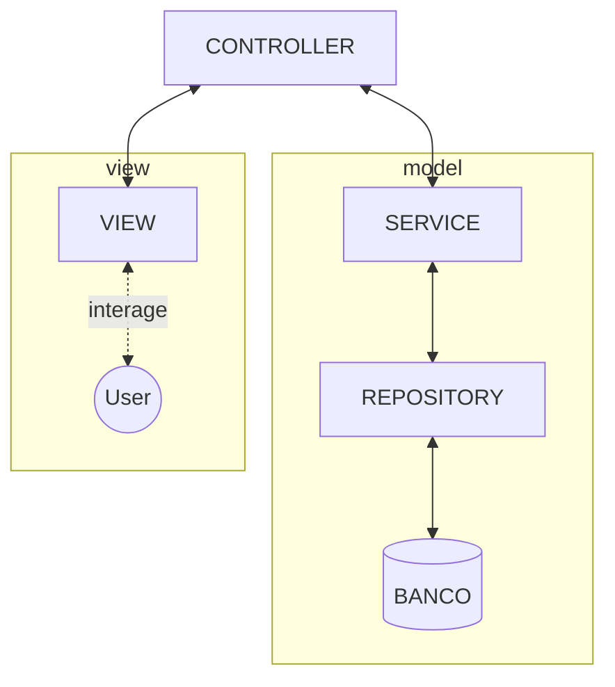

# Atividade da aula de Desenvolvimento para Servidores II

O professor Esdras Bezerra da Silva ministrou essa disciplina e, entre as atividades, havia a criação de um Sistema de Sugestões de Disciplina, utilizando o Spring Framework.

# Review Spring Framework

## O que é o Spring Boot?

## MVC o que é, onde vice e do que se alimenta?

